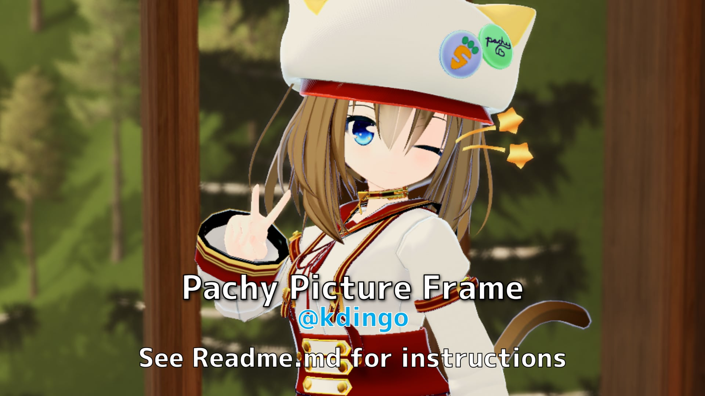

# Pachy Picture Frame
by pachipon@VRC

https://pachipawnshop.booth.pm/

A picture slide show made in UdonSharp. It is meant to be used in a VRChat SDK3 world.

PachyPictureFrameはUdonSharpのスライドショーです。VRC SDK3ワールド対応です。

## Features
 - Ordered and shuffle options
 - Picture sync between players
 - Multiple picture frames in one world supported

## Installation
 - Install [UdonSharp](https://github.com/MerlinVR/UdonSharp)
 - Grab the Prefab in Frames/ and place it into your scene.
	 - You may scale the prefab on the X and Y axes
 - Locate the prefab script settings under the Udon Behavior component
 - Set the Picture List size
 - Add pictures to the list
 - If you want a randomized list per instance, select Shuffle List
 - Set the time between pictures
 - Done!

## 器量 
- オーダーリスト、シャフルリスト
- ワールドシンク 
- 何数フレーム対応

## インスタル方
- [UdonSharp](https://github.com/MerlinVR/UdonSharp)をインストール
- FramesフォルダーからPrefabを取得し、シーンに配置してください。 
- PrefabはX軸とY軸で拡大縮小できます。
- Udon BehaviorコンポーネントでPrefabのスクリプト設定を見つけてください。
- ピクチャーリストのサイズを設定できます。
- ピクチャをリストに追加
- インスタンスごとにリストをランダム化したい場合は、「Shuffle List」を選択
- ピクチャー間隔を設定
- 完了です！

## Quirks
Picture Material in the Mesh Renderer and Screen Material in the Udon Behavior script must be the same.
There is no aspect ratio lock or auto resizing of different orientations. This prefab comes with landscape and portrait orientations in a 16:9 ratio.

Sync Mode should be set to Manual, but should not break anything if set to Continuous.

## Making new frames
You can create new picture frames, as long as you have a material slot for the picture to be displayed. The simplest custom frame is a plane object with one material, which is the picture material.

## Changelog
- 2021/11/25 added some simple frames, switched to Manual sync mode (VRCSDK3 2021.11.08.14.28)
- 2021/06/04 first release (VRCSDK3 2021.04.21.11.57)

## Contact
 - @kdingo on Twitter
 - pachipon on VRC
 - 日本語なんか弱いですけど、ぜひ何か聞いてください

## Credit

- [Shuffle algorithm](https://en.wikipedia.org/wiki/Fisher%E2%80%93Yates_shuffle)
- [Source code on Github](https://github.com/kdingo)

## Thanks to
My wonderful VRC friends and juicy momoniku

## License
This work is licensed under Creative Commons BY-SA
- EN: https://creativecommons.org/licenses/by-sa/4.0/
- JP: https://creativecommons.org/licenses/by-sa/4.0/deed.ja

> Written with [StackEdit](https://stackedit.io/).
